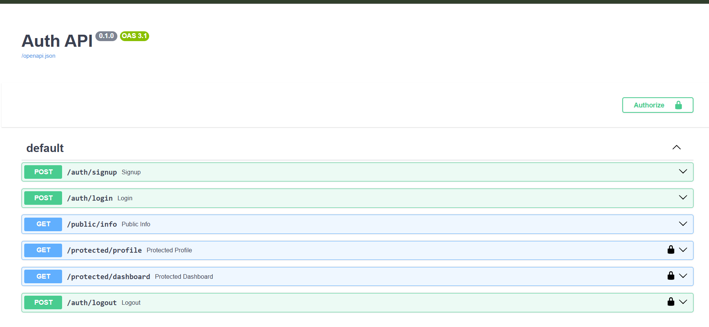
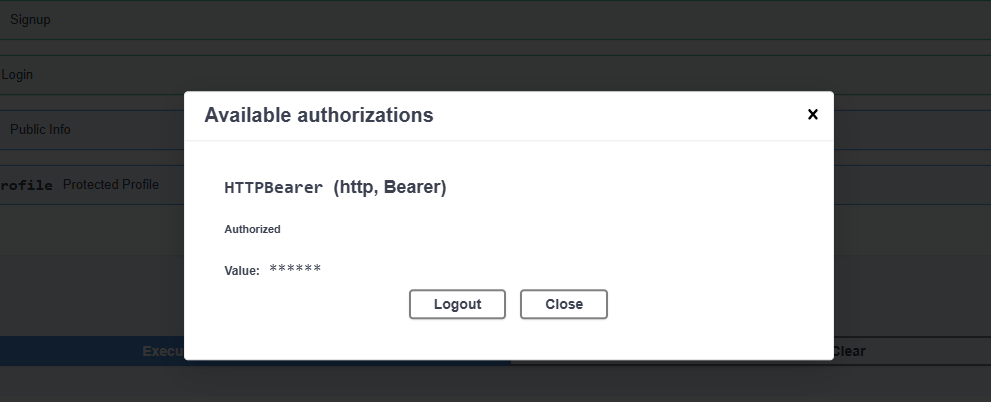
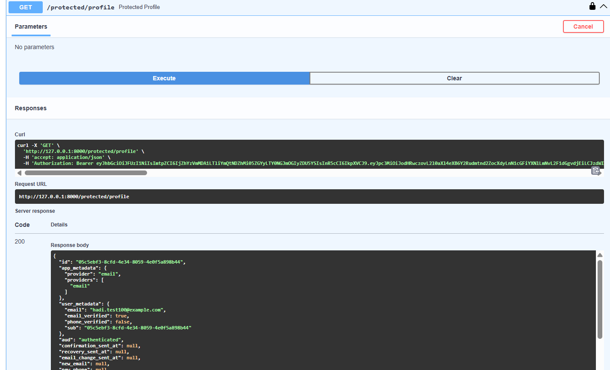

# Auth API — Secure Authentication with Supabase

A FastAPI backend that handles user signup, login, logout, and protected routes using Supabase Auth for identity management and JWT-based authorization.

## What this project does

This API demonstrates a full authentication flow:
- Users sign up and log in through Supabase Auth, which issues a JWT (access token)
- The client attaches that token to requests via the `Authorization: Bearer <token>` header
- Protected routes verify the token against Supabase before returning any data
- Public routes remain open with no auth required

## Tech stack

- Python 3.10+
- FastAPI
- Supabase (Auth)
- python-dotenv

## Setup

### 1. Clone the repo
```bash
git clone https://github.com/Abdulhadi489/auth-api.git
cd auth-api
```

### 2. Create a virtual environment
```bash
python -m venv venv
venv\Scripts\Activate.ps1      # Windows PowerShell
```

### 3. Install dependencies
```bash
pip install fastapi uvicorn supabase python-dotenv
```

### 4. Set up environment variables
Create a `.env` file in the project root with:
```
SUPABASE_URL=your_supabase_project_url
SUPABASE_KEY=your_supabase_anon_key
PORT=8000
```

You can get these from your own Supabase project under **Project Settings → API**.

### 5. Run the server
```bash
uvicorn main:app --reload --port 8000
```

The server will start on `http://localhost:8000`. Visit `http://localhost:8000/docs` for interactive Swagger documentation.

## API Reference

| Method | Route | Auth Required | Description |
|--------|-------|:---:|---|
| POST | `/auth/signup` | No | Create a new user account |
| POST | `/auth/login` | No | Authenticate and receive access + refresh tokens |
| POST | `/auth/logout` | Yes | End the current session |
| GET | `/protected/profile` | Yes | Return the authenticated user's profile data |
| GET | `/protected/dashboard` | Yes | Example of a second protected route using the same auth dependency |
| GET | `/public/info` | No | Open endpoint, no authentication needed |

## Authentication in Swagger UI

1. Click the **Authorize** button at the top of the `/docs` page
2. Paste your access token (obtained from `/auth/login`)
3. Click Authorize, then Close
4. All protected routes will now include your token automatically

### All routes, with lock icons on protected endpoints


### Authorize popup — confirming a token is attached


### Successful authorized request to a protected route


## Status Codes Used

| Code | Meaning |
|---|---|
| 200 | Successful login or protected data read |
| 201 | Account created successfully |
| 204 | Logout successful (no content returned) |
| 400 | Missing or invalid input |
| 401 | Missing, invalid, or expired token / wrong login credentials |

## Notes

- `.env` is excluded from version control via `.gitignore` — never commit real Supabase credentials.
- Token verification is handled through a reusable FastAPI dependency (`get_current_user`), applied to every protected route.